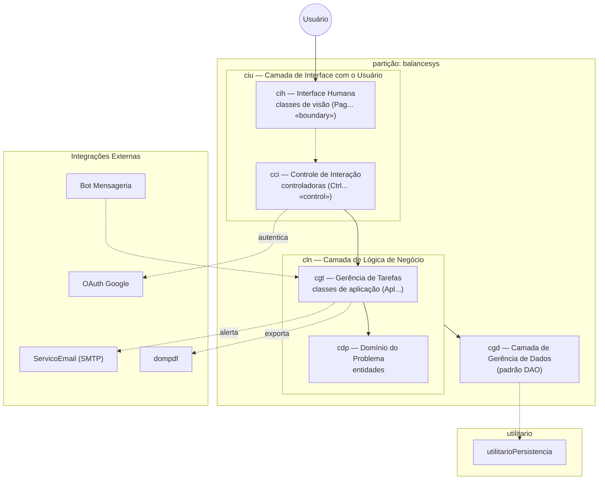

# Diagrama de Arquitetura — BalanceSys

> Artefato canônico referenciado pela Seção 4.3 da Especificação de Projeto (Issue #24).
> Método: Fábrica de Software (IFES/Serra) — partição única em três camadas. Formato: Mermaid.

## Diagrama de Pacotes (partição única + três camadas)

## Legenda

- **ciu / cln / cgd** — as três camadas da partição.
- **Setas cheias** — fluxo de controle descendente (visão → controle → aplicação → domínio → persistência).
- **Setas pontilhadas** — dependências (realimentação visão↔controle e chamadas a integrações externas/utilitário).

> Para exportar como PNG, abra este arquivo no GitHub ou cole o bloco em <https://mermaid.live> e use *Export*.
