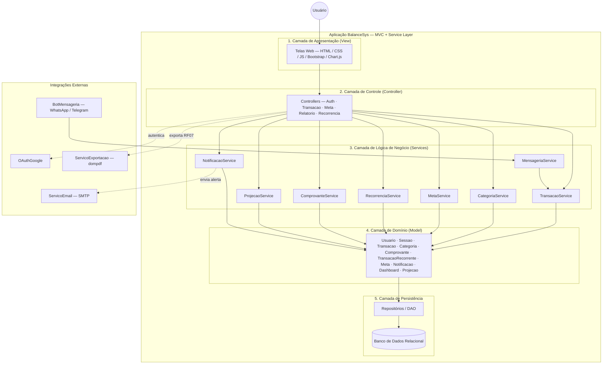

# Diagrama de Arquitetura — BalanceSys

> Artefato canônico referenciado pela Seção 4.3 da Especificação de Projeto (Issue #24).
> Formato: Mermaid (renderização nativa no GitHub).

## Visão em Camadas (MVC + Service Layer)

## Legenda

- **Setas cheias** — fluxo de controle interno (pedido → execução → persistência).
- **Setas pontilhadas** — chamadas a serviços externos.
- A numeração das camadas (1 a 5) indica a direção do fluxo de uma requisição típica.

> Para exportar como PNG, abra este arquivo no GitHub (que renderiza o Mermaid) ou cole o bloco em <https://mermaid.live> e use *Export*.
