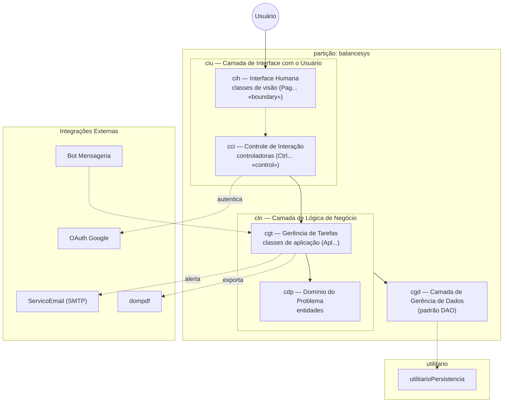
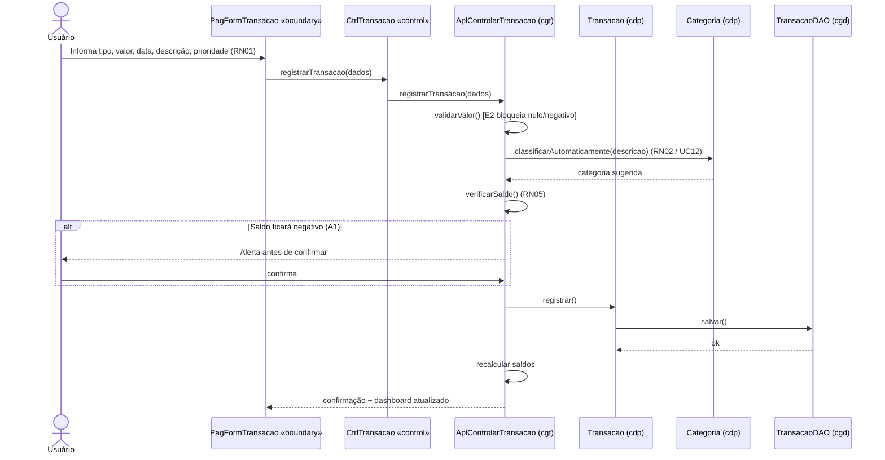
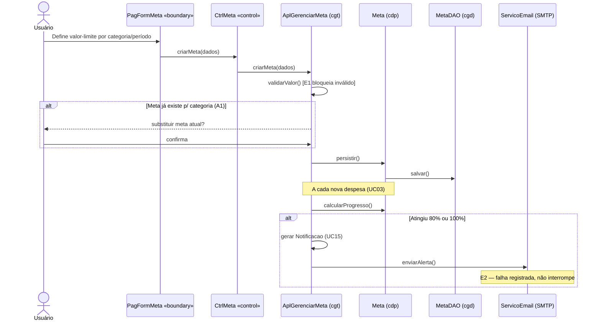

# 4. Arquitetura de Software

> **Especificação de Projeto — BalanceSys** · Milestone **M2** · Sprint **S2** · Epic **#20** · Issue **#24**
> Documento de Projeto, elaborado segundo o método de projeto arquitetural da Fábrica de Software (IFES/Serra), a partir da Especificação de Análise (minimundo, requisitos, casos de uso e modelo conceitual de classes).

*Nota de organização:* as subseções 4.1 e 4.2 correspondem, no gabarito completo da Fábrica, às seções de **Plataforma de Implementação** e **Atributos de Qualidade e Táticas** (que antecedem a arquitetura). São aqui mantidas sob a Seção 4 por aderência à numeração definida nas issues; em um documento finalizado, podem ser promovidas a seções próprias.

---

## 4.1 Plataforma de Implementação

O BalanceSys é um **Sistema de Informação** e apresenta as características que dele decorrem: envolve volume relevante de dados, cuja gerência se faz por banco de dados; os usuários acessam esses dados concorrentemente via Web; e há grande quantidade de interfaces com o usuário.

Considerando tais características — e em coerência com o protótipo já existente (`SystemFinance.md`) e com os serviços externos previstos na análise (notadamente o *dompdf*) — adota-se a seguinte plataforma:

| Dimensão | Tecnologia |
|---|---|
| Linguagem | PHP 7.4+ |
| Banco de dados | MySQL (relacional) |
| Interface (front-end) | HTML5, CSS3, Bootstrap 5.3, Chart.js |
| Exportação | dompdf (geração de PDF) |
| Autenticação federada | OAuth 2.0 (Google) |
| Integrações | SMTP (e-mail); API de mensageria (WhatsApp/Telegram) |

> *Observação de projeto:* o protótipo atual é procedural (arquivos `.php` independentes). A arquitetura aqui especificada impõe sobre essa base a disciplina de **camadas** e o padrão **MVC**, descritos a seguir — passo necessário para satisfazer a manutenibilidade exigida (RNF) e o desenvolvimento incremental previsto no `melhorias_sistema.md`.

---

## 4.2 Atributos de Qualidade e Táticas

A tabela a seguir lista os atributos de qualidade considerados **condutores da arquitetura** e as táticas adotadas para tratá-los.

| Categoria | RNFs considerados | Condutor? | Táticas |
|---|---|---|---|
| Segurança de Acesso | RNF03, RNF06 | Sim | Identificar usuários por login e autenticá-los por senha; isolar o acesso aos próprios dados (RN04) na fronteira controle→serviço; armazenar senha de forma segura (hash); tráfego sobre HTTPS |
| Manutenibilidade | RNF04 (e evolução incremental) | Sim | Separar a interface do restante da aplicação; usar intermediário para tratar as requisições da interface (controladoras); usar intermediário (DAO) para isolar o mecanismo de persistência |
| Usabilidade | RNF01, RNF07 | Não | Interface amigável e responsiva; técnicas de seleção e preenchimento automático (categorização — RN02); recursos de automonitoramento (Design Persuasivo — RNF07) |
| Portabilidade | RNF02, RNF05 | Não | Operar nos principais navegadores; suportar múltiplos idiomas (pt/en) |

A lógica é geométrica: a **segurança** e a **manutenibilidade** são os dois eixos que mais deformam a arquitetura, e por isso a moldam — as demais qualidades acomodam-se no espaço que esses eixos definem.

---

## 4.3 Visão Geral da Arquitetura

A arquitetura combina os estilos em **partições** e em **camadas**. Por decisão de projeto, o BalanceSys é tratado como **partição única** — denominada *balancesys* —, opção justificada pela coesão do domínio (todo o sistema gravita em torno da `Transacao` e do usuário a que ela pertence) e pela escala do projeto, que não recomenda a fragmentação em subsistemas.

A partição organiza-se em **três camadas**:

- **Camada de Interface com o Usuário (*ciu*)** — subdividida em *Camada de Controle de Interação (cci)*, com as classes controladoras *‹‹control››*, e *Camada de Interface Humana (cih)*, com as classes de visão *‹‹boundary››*;
- **Camada de Lógica de Negócio (*cln*)** — subdividida em *Camada de Gerência de Tarefas (cgt)*, com as classes de aplicação *Apl…*, e *Camada de Domínio do Problema (cdp)*, com as entidades;
- **Camada de Gerência de Dados (*cgd*)** — responsável pela persistência, mediante o padrão DAO.

Visando ao reúso, isola-se ainda um pacote *utilitario*, contendo o *utilitarioPersistencia* (tratamento genérico do padrão DAO).

> Diagrama canônico mantido também em `docs/diagramas/arquitetura_balancesys.md`.

A leitura é descendente: o usuário toca uma classe de visão (*cih*); a controladora (*cci*) traduz a interação e delega à gerência de tarefas (*cgt*); esta coordena as entidades do domínio (*cdp*); a persistência (*cgd*) torna o estado durável. As integrações externas pendem das camadas que as acionam.

---

## 4.4 Decisões Arquiteturais (ADR)

### ADR-01 — A classe `Transacao` é preservada como entidade central do *cdp*
**Decisão:** `Transacao` permanece como entidade de primeira classe, com estado e ciclo de vida próprios.
**Justificativa:** é a origem de todo o cálculo de saldo (`Dashboard`), das tendências (`Projecao`) e do progresso das metas (`Meta`); concentra as regras RN01, RN04, RN05 e RN06. Dispersá-la fragilizaria a integridade do histórico.

### ADR-02 — Não existe classe `Relatorio`
**Decisão:** relatórios, gráficos e exportação (RF14, RF07) **não** são modelados como entidade persistível do *cdp*.
**Justificativa:** um relatório é um **comportamento** executado dinamicamente sobre as transações — não um objeto com estado durável. Tais responsabilidades figuram como operações de aplicação no *cgt* (*AplEmitirRelatorios*), que aciona o *dompdf*. Persistir relatórios criaria redundância sujeita a divergência face à fonte. Em síntese: o relatório é fotografia tirada sob demanda, não quadro pendurado na parede.

---

## 4.5 Diagramas de Sequência (opcionais)

Os diagramas a seguir percorrem as camadas com os participantes do método: visão (*Pag…*), controle (*Ctrl…*), aplicação (*Apl…*), domínio (*cdp*) e persistência (*DAO*).

### 4.5.1 UC03 — Registrar Transação

### 4.5.2 UC11 — Gerenciar Metas Financeiras

---

## 4.6 Rastreabilidade Arquitetura → Requisitos

| Camada / Pacote | RFs | RNFs | RNs | UCs |
|---|---|---|---|---|
| *ciu* (cci + cih) | RF02, RF14, RF15, RF16 | RNF01, RNF05, RNF07 | — | UC07–UC09 |
| *cln* (cgt + cdp) | RF03–RF13 | RNF02 | RN01–RN06 | UC03–UC15 |
| *cgd* + *utilitario* | RF01, RF03 | RNF04, RNF06 | RN03, RN04 | — |
| Integrações externas | RF01, RF07, RF11, RF12, RF13 | RNF03 | RN03 | UC01, UC02, UC10, UC14, UC15 |

---

### Critérios de Aceite da Issue #24

- [x] Visão geral (camadas + MVC) — Seções 4.3 (e plataforma/táticas em 4.1–4.2)
- [x] Diagrama de Arquitetura (pacotes, Mermaid) — Seção 4.3 e `docs/diagramas/arquitetura_balancesys.md`
- [x] Módulos UI / Serviços / Domínio / Persistência → *ciu* / *cgt* / *cdp* / *cgd* — Seção 4.3
- [x] Decisão obrigatória: `Transacao` preservada (ADR-01) e ausência de `Relatorio` (ADR-02) — Seção 4.4
- [x] Sequência (opcional) para UC03 e UC11 — Seção 4.5
- [x] Descrição clara dos componentes e interações — Seções 4.3 a 4.6
