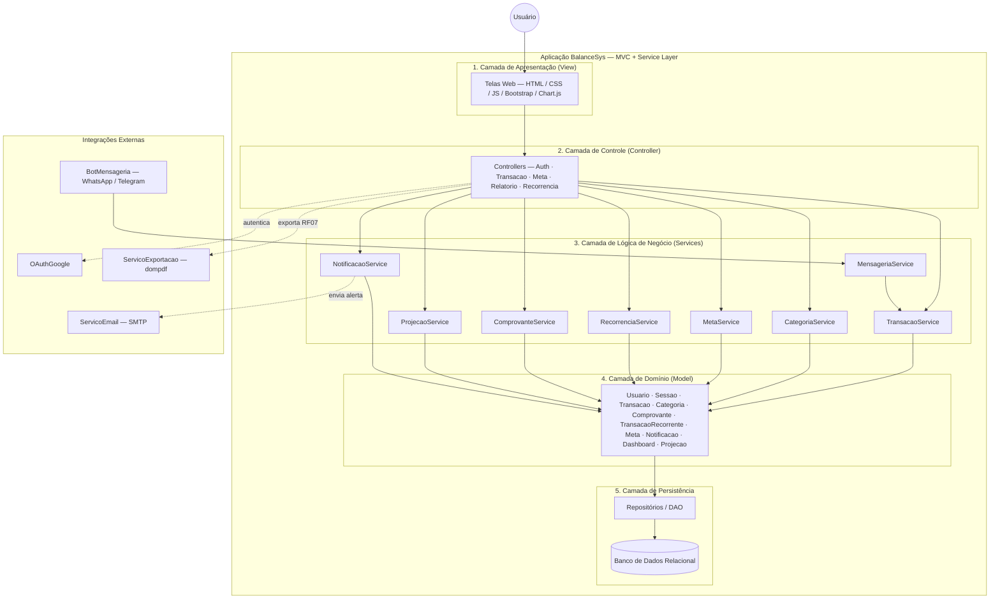
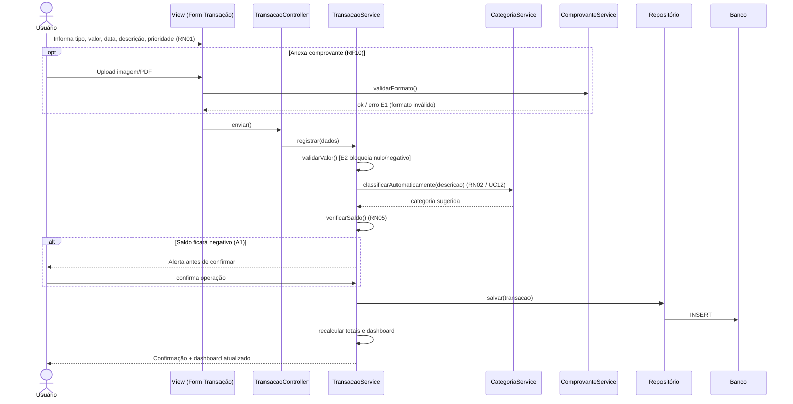
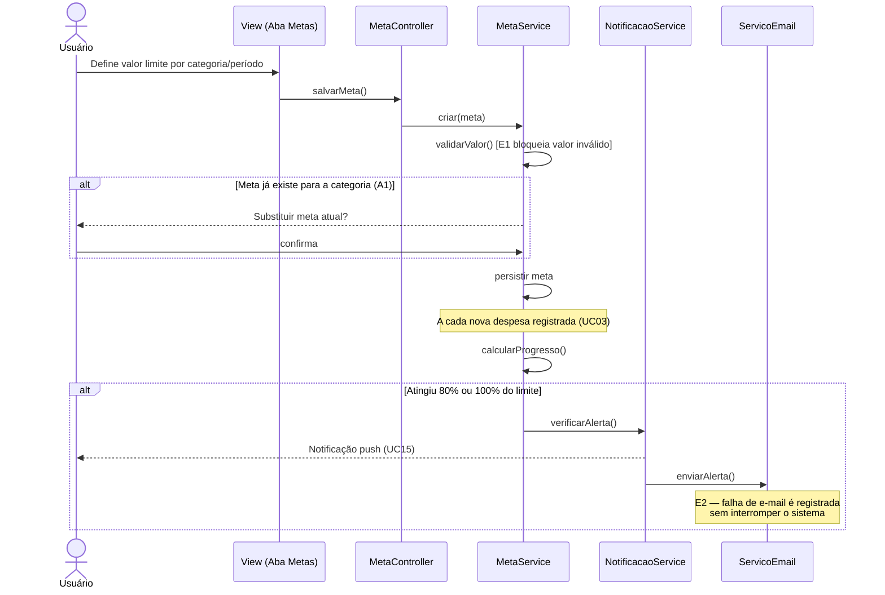

# 4. Arquitetura de Software

> **Especificação de Projeto — BalanceSys** · Milestone **M2** · Sprint **S2** · Epic **#20** · Issue **#24**
> Documento derivado da Especificação de Análise (minimundo, requisitos, casos de uso e modelo de classes).

---

## 4.1 Visão Geral

O **BalanceSys** é uma aplicação web de controle financeiro pessoal estruturada sobre o padrão **MVC (Model–View–Controller)** acrescido de uma **Camada de Serviços (Service Layer)**, que concentra a lógica de negócio descrita na Seção 5.1. A arquitetura organiza-se em **cinco camadas horizontais** mais um conjunto de **integrações externas**.

A metáfora útil aqui é a de um edifício: a *View* é a fachada que o morador vê e toca; o *Controller* é a portaria que recebe pedidos e os encaminha; os *Services* são o corpo técnico que executa o trabalho segundo as regras do condomínio (as Regras de Negócio); o *Domínio* são os cômodos e seus móveis (as entidades); e a *Persistência* é o alicerce que guarda tudo de forma durável. As integrações externas são os serviços terceirizados — correio, segurança, contabilidade — que o prédio contrata sem absorvê-los em sua estrutura.

| Camada | Responsabilidade | Tecnologias candidatas |
|---|---|---|
| Apresentação (View) | Renderizar telas, capturar entradas, exibir feedback | HTML, CSS, JavaScript, Bootstrap, Chart.js |
| Controle (Controller) | Receber requisições, orquestrar serviços, devolver respostas | Controladores HTTP |
| Lógica de Negócio (Services) | Aplicar regras, validar fluxos, coordenar o domínio | Classes de serviço (ver Seção 5.1) |
| Domínio (Model) | Representar entidades e seu estado | `Usuario`, `Transacao`, `Categoria`, `Meta`, etc. |
| Persistência | Mapear objetos ⇄ banco e garantir durabilidade | Repositórios / DAO + Banco Relacional |
| Integrações Externas | Conectar a serviços de terceiros | OAuth Google, Bot (WhatsApp/Telegram), SMTP, dompdf |

---

## 4.2 Estilo Arquitetural e Justificativa

A escolha do **MVC em camadas com Service Layer** atende diretamente requisitos não funcionais do projeto:

- **Separação de responsabilidades** — cada camada tem um motivo único de mudança. Alterar a aparência de uma tela (View) não obriga a tocar nas regras de cálculo de saldo (Service). Isso reduz o acoplamento e facilita a evolução incremental prevista no `melhorias_sistema.md`.
- **Testabilidade** — concentrar a lógica em *Services* puros permite testá-los isoladamente, sem subir a interface.
- **Segurança (RNF03, RNF06)** — a autorização por sessão (`RN04`) é aplicada na fronteira Controller → Service, garantindo que cada usuário acesse apenas os próprios dados antes que qualquer regra de negócio execute.
- **Substituibilidade das integrações** — tratar OAuth, mensageria, e-mail e exportação como serviços externos atrás de fronteiras bem definidas permite trocar um provedor (ex.: dompdf por outra biblioteca) sem propagar a mudança para o domínio.

---

## 4.3 Diagrama de Arquitetura

> Diagrama canônico mantido também em `docs/diagramas/arquitetura_balancesys.md`.

A leitura do diagrama é **de cima para baixo**: o pedido do usuário desce pela fachada (View), passa pela portaria (Controller), é executado pelos *Services* segundo as regras de negócio, manipula entidades do Domínio e termina gravado na Persistência. As setas pontilhadas representam saídas para serviços externos.

---

## 4.4 Descrição dos Módulos

### 4.4.1 Módulo de Interface (UI)
Responsável por toda interação visual: formulários de transação, dashboard, telas de metas, histórico e relatórios. Não contém regra de negócio — apenas captura entradas, dispara ações e apresenta o feedback persuasivo previsto no **RNF07**. Detalhado na Seção 5.2.

### 4.4.2 Módulo de Serviços (Lógica de Negócio)
Coração da aplicação. Reúne os oito serviços que implementam as regras `RN01–RN06` e os requisitos funcionais. É a única camada autorizada a coordenar entidades de domínio e disparar integrações externas. Detalhado na Seção 5.1.

### 4.4.3 Módulo de Domínio
Conjunto das entidades conceituais e suas enumerações (`TipoTransacao`, `PrioridadeGasto`, `TipoArquivo`, `Periodicidade`, `TipoNotificacao`). Carrega o estado do sistema; comportamentos complexos que cruzam várias entidades sobem para a Camada de Serviços.

### 4.4.4 Módulo de Persistência
Abstrai o acesso ao banco relacional por meio de repositórios/DAO, isolando o domínio dos detalhes de SQL. Sustenta o **RNF04** (backup automático) e o **RNF06** (proteção e criptografia de dados sensíveis, como `senhaHash`).

### 4.4.5 Integrações Externas
- **OAuthGoogle** — autenticação federada (UC01, UC02 / RF01).
- **BotMensageria** — registro e consulta por mensagem (UC14 / RF11, RF12).
- **ServicoEmail (SMTP)** — alertas e resumos (UC11, UC15 / RF13).
- **ServicoExportacao (dompdf)** — geração de PDF/planilha (UC10 / RF07).

---

## 4.5 Decisões Arquiteturais (ADR)

### ADR-01 — A classe `Transacao` é preservada como entidade central
**Decisão:** `Transacao` permanece como entidade de primeira classe, com estado e ciclo de vida próprios.
**Justificativa:** é a origem de todos os cálculos de saldo (`Dashboard`), das tendências (`Projecao`) e dos progressos de meta (`Meta`). Concentra as regras `RN01`, `RN04`, `RN05` e `RN06`. Removê-la ou fundi-la a outra entidade dispersaria essas regras e fragilizaria a integridade do histórico.

### ADR-02 — Não existe classe `Relatorio`
**Decisão:** relatórios, gráficos e exportação (**RF14** e **RF07**) **não** são modelados como entidade persistível.
**Justificativa:** um relatório é um **comportamento** executado dinamicamente sobre as transações, e não um objeto com estado durável. Essas responsabilidades são expostas como métodos do `Dashboard` (`gerarGrafico()`, `exportarPDF()`, `exportarPlanilha()`), que aciona o `ServicoExportacao` diretamente. Persistir relatórios criaria dados redundantes e sujeitos a divergência em relação à fonte (as transações). Em uma frase: relatório é *fotografia tirada sob demanda*, não *quadro pendurado na parede*.

---

## 4.6 Diagramas de Sequência (opcionais)

### 4.6.1 UC03 — Registrar Transação

### 4.6.2 UC11 — Gerenciar Metas Financeiras

---

## 4.7 Rastreabilidade Arquitetura → Requisitos

| Elemento arquitetural | RFs | RNFs | RNs | UCs |
|---|---|---|---|---|
| Camada de Apresentação | RF02, RF14, RF15, RF16 | RNF01, RNF05, RNF07 | — | UC07–UC09 |
| Camada de Serviços | RF03–RF13 | RNF02 | RN01–RN06 | UC03–UC15 |
| Camada de Domínio | RF01–RF14 | — | RN01–RN06 | todos |
| Camada de Persistência | RF01, RF03 | RNF04, RNF06 | RN03, RN04 | — |
| OAuthGoogle | RF01 | RNF03 | RN03 | UC01, UC02 |
| BotMensageria | RF11, RF12 | RNF02 | — | UC14 |
| ServicoEmail (SMTP) | RF13 | — | — | UC11, UC15 |
| ServicoExportacao (dompdf) | RF07 | — | — | UC10 |

---

### Critérios de Aceite da Issue #24

- [x] Visão geral (MVC + serviços auxiliares) — Seção 4.1 e 4.2
- [x] Diagrama de Arquitetura (Mermaid) — Seção 4.3 e `docs/diagramas/arquitetura_balancesys.md`
- [x] Módulos UI / Serviços / Domínio / Persistência descritos — Seção 4.4
- [x] Decisão obrigatória: `Transacao` preservada (ADR-01) e ausência de `Relatorio` (ADR-02) — Seção 4.5
- [x] Sequência (opcional) para UC03 e UC11 — Seção 4.6
- [x] Descrição clara dos componentes e interações — Seções 4.4 a 4.7
