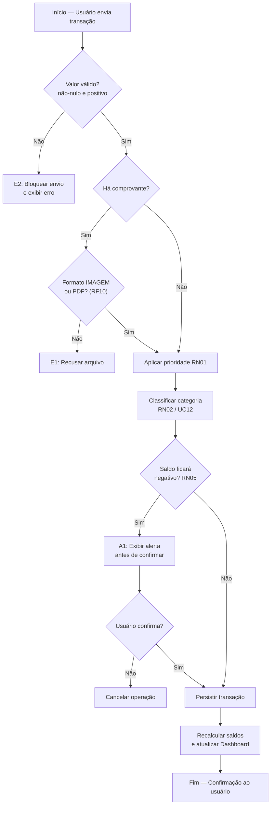
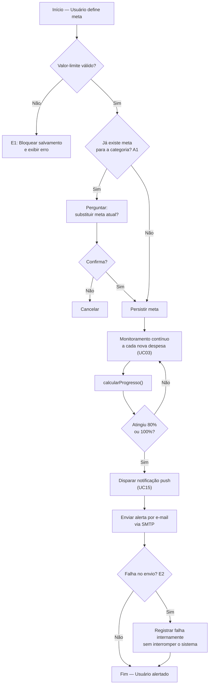

# 5.1 Camada de Lógica de Negócio

> **Especificação de Projeto — BalanceSys** · Milestone **M2** · Sprint **S2** · Epic **#20** · Issue **#25**

---

## 5.1.1 Visão Geral

A Camada de Lógica de Negócio implementa o padrão **Service Layer**: cada serviço é uma classe sem estado persistente que **orquestra entidades de domínio, aplica regras de negócio e coordena integrações externas**, mediando entre a Camada de Controle (que recebe a requisição) e a Camada de Persistência (que a torna durável).

A regra de ouro desta camada: **nenhuma regra de negócio vive na View nem no Controller**. O Controller apenas traduz a requisição e delega; o serviço decide. Assim, se a regra `RN06` (prazo de edição) mudar de 7 para 30 dias, há um único ponto de alteração — como uma central elétrica que controla todas as lâmpadas a partir de um quadro só.

---

## 5.1.2 Serviços Principais

### TransacaoService
**Responsabilidade:** núcleo operacional do sistema — registrar, editar e excluir movimentações, recalcular saldos e acionar a categorização e a validação de regras.

| Operação | Descrição | Rastreabilidade |
|---|---|---|
| `registrar(dados)` | Valida valor, aciona categorização, verifica saldo e persiste | RF03, RN01, RN05, UC03 |
| `editar(id, dados)` | Atualiza dentro da janela permitida | RF04, RN06, UC05 |
| `excluir(id)` | Remove verificando propriedade e prazo | RF04, RN04, RN06, UC04 |
| `recalcularSaldo()` | Reprocessa totais após qualquer mutação | RF02 |

**Colabora com:** `CategoriaService` (classificação), `ComprovanteService` (anexo), `NotificacaoService` (alerta de saldo). **Entidade:** `Transacao`.

---

### CategoriaService — RN02
**Responsabilidade:** classificar automaticamente as transações pela análise textual da descrição, atendendo à regra `RN02` e ao UC12.

| Operação | Descrição | Rastreabilidade |
|---|---|---|
| `classificarAutomaticamente(descricao)` | Cruza a descrição com palavras-chave/histórico e sugere a categoria | RN02, RF06, RF14, UC12 |
| `listarCategorias()` | Fornece o conjunto de categorias para filtros e relatórios | RF06, RF14 |

**Exemplo de regra:** `"mercado" → Alimentação`, `"uber" → Transporte`. Se nenhuma palavra-chave casar, o serviço **não** força sugestão e devolve o controle ao usuário (fluxo A1 do UC12). **Entidade:** `Categoria`.

---

### MetaService — RF05 / RN05
**Responsabilidade:** criar e acompanhar metas de gasto/economia, calcular progresso e disparar alertas.

| Operação | Descrição | Rastreabilidade |
|---|---|---|
| `criar(meta)` | Valida valor-limite e persiste; trata meta duplicada | RF05, UC11 |
| `calcularProgresso()` | Retorna o percentual atingido | RF05, RF16 |
| `verificarAlerta()` | Dispara notificação a 80% e a 100% do limite | RF13, RF17, UC11 |
| `atualizar()` | Recalcula `valorAtual` a cada nova transação | RF05 |

> **Nota de rastreabilidade:** a Issue #25 associa este serviço a `RN05`. Em rigor, `RN05` (alerta de saldo negativo ao registrar despesa) é aplicada no **`TransacaoService`**; o `MetaService` realiza o RF05 e os alertas de meta (RF13/RF17). A ligação conceitual entre ambos é a **prevenção financeira por antecipação**: um avisa sobre o saldo, o outro sobre o limite planejado.

**Colabora com:** `NotificacaoService`, `ServicoEmail` (SMTP). **Entidade:** `Meta`.

---

### RecorrenciaService — RF09
**Responsabilidade:** gerenciar transações periódicas (aluguel, salário, assinaturas), lançando instâncias de `Transacao` nas datas programadas.

| Operação | Descrição | Rastreabilidade |
|---|---|---|
| `agendar(regra)` | Persiste a regra de recorrência | RF09, UC06 |
| `cancelar(id)` | Desativa lançamentos futuros sem apagar o histórico | RF09, UC06 (A1) |
| `gerarTransacao()` | Cria a `Transacao` na `proximaData` | RF09 |

**Colabora com:** `TransacaoService`. **Entidade:** `TransacaoRecorrente`.

---

### ComprovanteService — RF10
**Responsabilidade:** validar e vincular arquivos (imagem ou PDF) como evidência de transações.

| Operação | Descrição | Rastreabilidade |
|---|---|---|
| `validarFormato(arquivo)` | Aceita apenas IMAGEM ou PDF (bloqueia o resto) | RF10, UC03 (E1) |
| `anexar(transacaoId, arquivo)` | Associa o comprovante à transação | RF10, UC05 |

**Entidade:** `Comprovante` · **Enumeração:** `TipoArquivo`.

---

### ProjecaoService — RF08
**Responsabilidade:** estimar o saldo futuro a partir das tendências do histórico.

| Operação | Descrição | Rastreabilidade |
|---|---|---|
| `validarHistoricoSuficiente()` | Exige ao menos 2 meses de dados | RF08, UC13 (A1) |
| `calcularProjecao()` | Aplica algoritmo de tendência e projeta o saldo | RF08, UC13 |

**Regra:** com histórico insuficiente, o serviço retorna aviso em vez de projeção — não se extrapola tendência a partir de ruído. **Entidade:** `Projecao`.

---

### NotificacaoService — RF13
**Responsabilidade:** gerar e entregar alertas (push e e-mail) sobre saldo, vencimentos e metas.

| Operação | Descrição | Rastreabilidade |
|---|---|---|
| `gerar(tipo, mensagem)` | Cria a notificação | RF13, UC15 |
| `enviar()` | Publica via push e, quando aplicável, aciona o `ServicoEmail` | RF13, RF15, RF17 |
| `marcarComoLida(id)` | Atualiza o estado de leitura | RF13 |

**Colabora com:** `ServicoEmail` (SMTP). **Entidade:** `Notificacao` · **Enumeração:** `TipoNotificacao`.

---

### MensageriaService — RF11 / RF12
**Responsabilidade:** processar comandos em linguagem natural vindos do bot (texto/áudio), registrando transações ou consultando saldo.

| Operação | Descrição | Rastreabilidade |
|---|---|---|
| `processarComando(mensagem)` | Interpreta a intenção e roteia para o serviço correto | RF11, RF12, UC14 |
| `registrarPorMensagem()` | Cria transação via `TransacaoService` | RF11, UC14 |
| `consultarSaldo()` | Lê os totais do `Dashboard` | RF12, UC14 |

**Colabora com:** `TransacaoService`, `Dashboard`, `BotMensageria`. **Tratamento de exceção:** número não vinculado (E1) e mensagem incompreendida (E2) retornam orientação ao usuário.

---

## 5.1.3 Regras de Negócio no Domínio (RN01–RN06)

| Regra | Descrição | Onde é aplicada | RFs |
|---|---|---|---|
| RN01 | Prioridade de gasto na transação | `TransacaoService.registrar()` via enum `PrioridadeGasto` | RF03 |
| RN02 | Categorização automática | `CategoriaService.classificarAutomaticamente()` | RF03, RF06, RF14 |
| RN03 | Conta única por usuário | Validação de unicidade no cadastro (Auth) | RF01 |
| RN04 | Acesso apenas aos próprios dados | Fronteira Controller→Service (autorização por sessão) | RF01, RF03, RF04 |
| RN05 | Alerta de saldo negativo | `TransacaoService.verificarSaldo()` | RF03, RF13 |
| RN06 | Bloqueio de edição após prazo | `TransacaoService.validarPrazoEdicao()` | RF04 |

---

## 5.1.4 Fluxo de Validações — UC03 (Registrar Transação)

**Ordem das validações (do barato ao caro):** primeiro o que é local e instantâneo (valor, formato de arquivo); depois o que exige consulta (categorização, saldo). Validar do mais simples ao mais custoso é como conferir o ingresso antes de revistar a bagagem — barra-se o caso inválido no ponto de menor esforço.

---

## 5.1.5 Fluxo de Validações — UC11 (Gerenciar Metas)

**Princípio de resiliência:** a falha do e-mail (E2) é tratada como **degradação suave** — o sistema registra o erro e segue funcionando. A notificação push já cumpriu o objetivo de avisar; o e-mail é redundância, não dependência.

---

## 5.1.6 Rastreabilidade Serviço → Requisitos

| Serviço | RFs | RNs | RNFs | UCs |
|---|---|---|---|---|
| TransacaoService | RF03, RF04 | RN01, RN04, RN05, RN06 | RNF02 | UC03, UC04, UC05 |
| CategoriaService | RF06, RF14 | RN02 | — | UC12 |
| MetaService | RF05, RF16, RF17 | (relaciona RN05) | — | UC11 |
| RecorrenciaService | RF09 | — | — | UC06 |
| ComprovanteService | RF10 | — | RNF02 | UC03, UC05 |
| ProjecaoService | RF08 | — | — | UC13 |
| NotificacaoService | RF13, RF15, RF17 | — | — | UC15 |
| MensageriaService | RF11, RF12 | — | RNF02 | UC14 |

---

### Critérios de Aceite da Issue #25

- [x] Descrição completa dos serviços (8 serviços) — Seção 5.1.2
- [x] Relação com RF/RN/RNF clara — Seções 5.1.2, 5.1.3 e 5.1.6
- [x] Fluxo de validações do UC03 e UC11 — Seções 5.1.4 e 5.1.5
- [x] Regras aplicadas no domínio (RN01–RN06) — Seção 5.1.3
