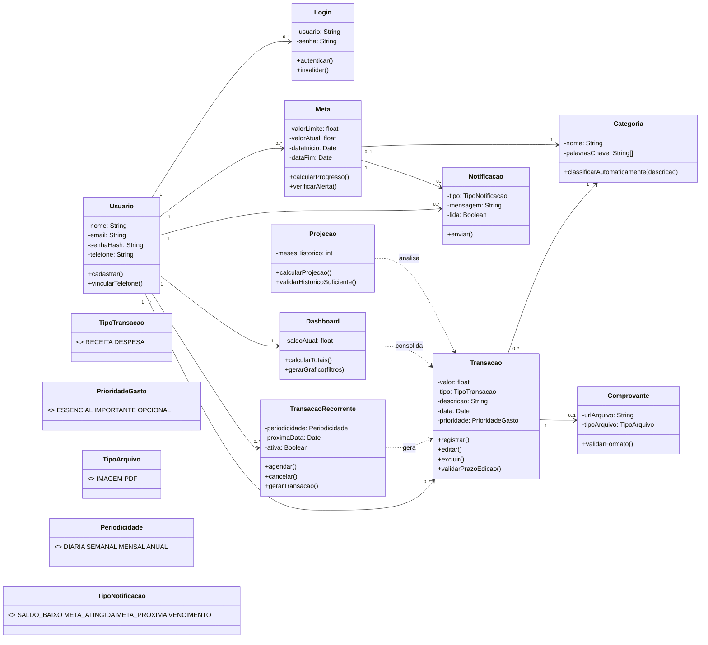
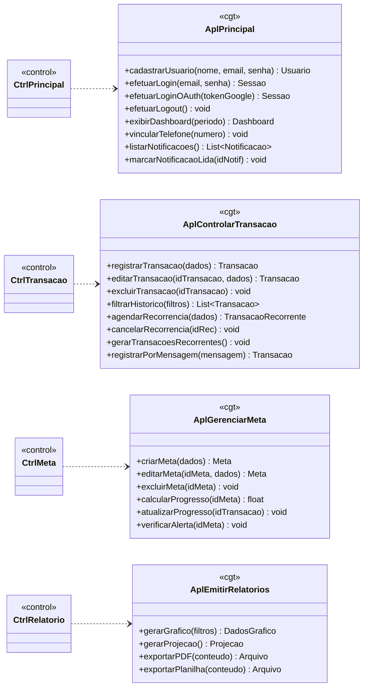
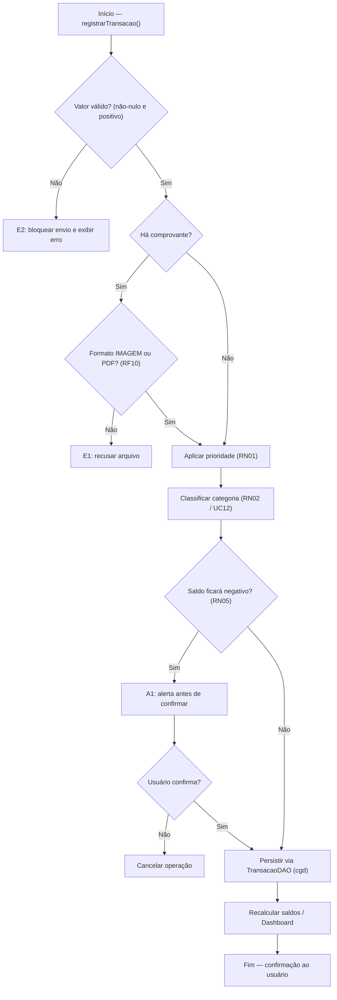
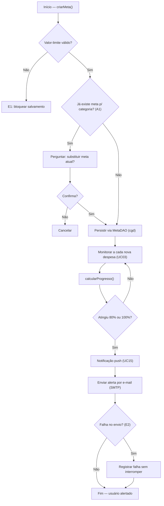

# 5.1 Camada de Lógica de Negócio

> **Especificação de Projeto — BalanceSys** · Milestone **M2** · Sprint **S2** · Epic **#20** · Issue **#25**
> Projeto de componentes da camada *cln*, segundo o método da Fábrica de Software (IFES/Serra).
> Versão consolidada: o *cdp* reaproveita o diagrama de classes refatorado do repositório; o *cgt* (Seção 5.1.2) foi aprofundado a ponto de orientar a implementação.

---

## 5.1 — Camada de Lógica de Negócio (*cln*)

Para organizar a camada de lógica de negócio, adota-se o padrão **Camada de Serviço**. A camada divide-se, assim, em dois componentes: o **Componente de Domínio do Problema (*cdp*)**, que trata os conceitos do domínio advindos do modelo conceitual elaborado na análise; e o **Componente de Gerência de Tarefas (*cgt*)**, que trata a lógica de aplicação — recebe as requisições das controladoras (*cci*) e as orquestra sobre o domínio. A regra de fronteira: nenhuma regra de negócio reside na visão ou na controladora; estas apenas traduzem e delegam.

---

## 5.1.1 Componente de Domínio do Problema (*cdp*)

O *cdp* reúne as entidades, suas associações e os tipos enumerados, conforme o diagrama de classes refatorado do repositório (`docs/DiagramaClasses/balancesys_diagrama_classes.md`). O diagrama abaixo apresenta o domínio do BalanceSys.

**Refinamentos de projeto** (em relação ao modelo de análise): introduziu-se a classe *Login*, com o intuito de realizar o controle de acesso de usuários (RNF03, RN04), desacoplando a credencial da entidade *Usuario*; manteve-se em *Dashboard* o atributo derivado *saldoAtual*, recalculado a cada movimentação, com a finalidade de aumentar o desempenho da consulta — eliminando a necessidade de recomputar o saldo a cada solicitação; e consolidaram-se os tipos enumerados, que conferem ao domínio um vocabulário fechado e verificável.

---

## 5.1.2 Componente de Gerência de Tarefas (*cgt*)

No projeto do *cgt*, optou-se por criar classes gerenciadoras (*Apl…*) que abrangem casos de uso fortemente relacionados — buscando coesão funcional. Os critérios de agrupamento foram: reunir as funcionalidades de identidade e acesso (cadastro, login, logout) e o ponto de entrada (dashboard) sob uma gerência principal; manter juntas as operações sobre a transação e suas variações (edição, exclusão, recorrência, filtragem de histórico); isolar a gerência de metas; e reunir as funcionalidades de visualização e exportação — que, surgindo novos relatórios, agrupar-se-iam facilmente, em favor da manutenibilidade.

O *cgt* trata a **lógica de aplicação**: recebe requisições da *cci*, orquestra as entidades do *cdp*, aciona a persistência (*cgd*) e as integrações externas. Distinção essencial — o *cgt* **não duplica** a regra que já vive na entidade; ele **coordena** sua execução no momento certo do fluxo. A regra mora no domínio; a sequência mora na gerência.

A Tabela A sumariza as relações entre as classes do *cgt* e os casos de uso por elas tratados.

| Classe (*cgt*) | Casos de Uso tratados |
|---|---|
| *AplPrincipal* | Cadastrar Usuário (UC01); Fazer Login (UC02); Fazer Logout (UC16); Visualizar Dashboard (UC08); Visualizar/Ler Notificações (UC15) |
| *AplControlarTransacao* | Registrar Transação (UC03); Excluir Transação (UC04); Editar Transação (UC05); Agendar Recorrência (UC06); Filtrar Histórico (UC07); Classificar Automaticamente (UC12); Registrar/Consultar via Mensageria (UC14) |
| *AplGerenciarMeta* | Gerenciar Metas Financeiras (UC11) |
| *AplEmitirRelatorios* | Visualizar Relatórios (UC09); Exportar Dados (UC10); Visualizar Projeção (UC13) |

*Tabela A — Classes do cgt e Casos de Uso.*

### 5.1.2.1 Diagrama combinado *cgt* + *ciu*

Seguindo o padrão da Fábrica (Figura 6 do Tibico), as controladoras *‹‹control››* da *cci* ligam-se às gerências *Apl…* do *cgt*. As operações abaixo já trazem assinatura completa.

### 5.1.2.2 Detalhamento das classes de aplicação

Para cada operação: o que faz, quais métodos do domínio (*cdp*) invoca, quais DAOs da *cgd* aciona, e o arquivo do protótipo (`.php`) correspondente — ponte direta para a implementação.

**AplPrincipal** — identidade, acesso e ponto de entrada.

| Operação | Colabora com (cdp / cgd / externo) | Regras | RF/UC | Arquivo |
|---|---|---|---|---|
| `cadastrarUsuario(nome, email, senha): Usuario` | `Usuario.cadastrar()`; `UsuarioDAO` | RN03 | RF01 / UC01 | `cadastro.php` |
| `efetuarLogin(email, senha): Sessao` | `Usuario.login()`; `Sessao`; `SessaoDAO` | RN04 | RF01 / UC02 | `login.php` |
| `efetuarLoginOAuth(tokenGoogle): Sessao` | `OAuthGoogle`; `Usuario`; `Sessao` | RN03, RN04 | RF01 / UC01, UC02 | `login.php` |
| `efetuarLogout(): void` | `Sessao.invalidar()` | RN04 | RF01 / UC16 | `logout.php` |
| `exibirDashboard(periodo): Dashboard` | `Dashboard.calcularTotais()` | RN04 | RF02 / UC08 | `index.php` |
| `vincularTelefone(numero): void` | `Usuario.vincularTelefone()` | — | RF11, RF12 / UC14 | — |
| `listarNotificacoes(): List<Notificacao>` | `NotificacaoDAO` | RN04 | RF13 / UC15 | `index.php` |
| `marcarNotificacaoLida(idNotif): void` | `Notificacao.marcarComoLida()` | — | RF13 / UC15 | `index.php` |

*Contrato de `efetuarLogin`* — entrada: e-mail e senha; saída: `Sessao` válida; exceção E1: credenciais inválidas → mensagem inline; pós-condição: sessão ativa libera apenas os dados do próprio usuário (RN04).

**AplControlarTransacao** — ciclo de vida da `Transacao` e variações.

| Operação | Colabora com (cdp / cgd / externo) | Regras | RF/UC | Arquivo |
|---|---|---|---|---|
| `registrarTransacao(dados): Transacao` | `Comprovante.validarFormato()`; `Categoria.classificarAutomaticamente()`; `Transacao.registrar()`; `Dashboard.calcularTotais()`; `TransacaoDAO` | RN01, RN02, RN05 | RF03, RF10 / UC03 | `transacao.php` |
| `editarTransacao(idTransacao, dados): Transacao` | `Transacao.validarPrazoEdicao()`; `Transacao.editar()`; `TransacaoDAO` | RN04, RN06 | RF04 / UC05 | `transacao.php` |
| `excluirTransacao(idTransacao): void` | `Transacao.validarPrazoEdicao()`; `Transacao.excluir()`; `TransacaoDAO` | RN04, RN06 | RF04 / UC04 | `transacao.php` |
| `filtrarHistorico(filtros): List<Transacao>` | `TransacaoDAO.obter(filtros)` | RN04 | RF06 / UC07 | `index.php` |
| `agendarRecorrencia(dados): TransacaoRecorrente` | `TransacaoRecorrente.agendar()`; `RecorrenciaDAO` | — | RF09 / UC06 | — |
| `cancelarRecorrencia(idRec): void` | `TransacaoRecorrente.cancelar()` | — | RF09 / UC06 | — |
| `gerarTransacoesRecorrentes(): void` | `TransacaoRecorrente.gerarTransacao()`; `Transacao` | — | RF09 / UC06 | (rotina agendada) |
| `registrarPorMensagem(mensagem): Transacao` | `BotMensageria`; reutiliza `registrarTransacao()` | RN01, RN02, RN05 | RF11 / UC14 | — |

*Contrato de `registrarTransacao`* — entrada: valor, tipo, data, descrição, prioridade e (opcional) comprovante; saída: `Transacao` persistida; exceções: E1 (formato inválido), E2 (valor nulo/negativo); alerta A1: saldo negativo (RN05) exige confirmação; pós-condição: saldo recalculado e, havendo meta da categoria, dispara `AplGerenciarMeta.atualizarProgresso()`.

**AplGerenciarMeta** — criação e acompanhamento de metas.

| Operação | Colabora com (cdp / cgd / externo) | Regras | RF/UC | Arquivo |
|---|---|---|---|---|
| `criarMeta(dados): Meta` | `Meta`; `MetaDAO` | — | RF05 / UC11 | — |
| `editarMeta(idMeta, dados): Meta` | `Meta`; `MetaDAO` | — | RF05 / UC11 | — |
| `excluirMeta(idMeta): void` | `MetaDAO` | RN04 | RF05 / UC11 | — |
| `calcularProgresso(idMeta): float` | `Meta.calcularProgresso()` | — | RF05, RF16 / UC11 | — |
| `atualizarProgresso(idTransacao): void` | `Meta.atualizar()`; chama `verificarAlerta()` | — | RF05 / UC11 | — |
| `verificarAlerta(idMeta): void` | `Meta.verificarAlerta()`; `Notificacao.enviar()`; `ServicoEmail` | — | RF13, RF17 / UC11, UC15 | — |

*Contrato de `criarMeta`* — exceção E1: valor-limite inválido bloqueia; alternativa A1: meta já existente para a categoria oferece substituição. *Contrato de `verificarAlerta`* — a 80%/100% gera `Notificacao` (push) e tenta e-mail; exceção E2: falha de SMTP é registrada sem interromper (degradação suave).

**AplEmitirRelatorios** — visualização dinâmica e exportação (coerente com a ADR-02).

| Operação | Colabora com (cdp / cgd / externo) | Regras | RF/UC | Arquivo |
|---|---|---|---|---|
| `gerarGrafico(filtros): DadosGrafico` | `Dashboard.gerarGrafico()`; `TransacaoDAO` | RN04 | RF14 / UC09 | `index.php` |
| `gerarProjecao(): Projecao` | `Projecao.validarHistoricoSuficiente()`; `Projecao.calcularProjecao()` | — | RF08 / UC13 | — |
| `exportarPDF(conteudo): Arquivo` | `Dashboard.exportarPDF()`; `ServicoExportacao` (dompdf) | RN04 | RF07 / UC10 | — |
| `exportarPlanilha(conteudo): Arquivo` | `Dashboard.exportarPlanilha()`; `ServicoExportacao` | RN04 | RF07 / UC10 | — |

*Contrato de `gerarProjecao`* — pré-condição: histórico ≥ 2 meses; alternativa A1: histórico insuficiente → retorna aviso. *Contrato de `exportarPDF`* — exceção E1: falha de geração → mensagem recuperável.

### 5.1.2.3 Notas de implementação (ponte para o protótipo)

O protótipo atual (`SystemFinance.md`) é procedural: `transacao.php` mistura interface, regra e acesso a banco. Migrar para o *cgt* significa **extrair** essa lógica para classes de aplicação, deixando os `.php` no papel de visão/controle:

- `cadastro.php` → *CtrlPrincipal* → *AplPrincipal.cadastrarUsuario()*
- `login.php` / `logout.php` → *CtrlPrincipal* → *AplPrincipal.efetuarLogin() / efetuarLogout()*
- `index.php` → *CtrlPrincipal* + *CtrlRelatorio* → *AplPrincipal.exibirDashboard()*, *AplEmitirRelatorios.gerarGrafico()*
- `transacao.php` → *CtrlTransacao* → *AplControlarTransacao.registrarTransacao() / editar / excluir*
- `conexao.php` → embrião da *cgd* (origem dos DAOs)

A regra prática: cada `.php` deixa de "saber fazer" e passa a "saber a quem pedir".

---

## 5.1.3 Regras de Negócio no Domínio (RN01–RN06)

| Regra | Descrição | Onde é aplicada | RFs |
|---|---|---|---|
| RN01 | Prioridade de gasto na transação | *Transacao* (cdp) via *PrioridadeGasto*, em *AplControlarTransacao.registrarTransacao()* | RF03 |
| RN02 | Categorização automática | *Categoria.classificarAutomaticamente()* (cdp), acionada pelo *cgt* | RF03, RF06, RF14 |
| RN03 | Conta única por usuário | *AplPrincipal.cadastrarUsuario()* (validação de unicidade) | RF01 |
| RN04 | Acesso apenas aos próprios dados | Fronteira *cci → cgt* (autorização via *Login*/sessão) | RF01, RF03, RF04 |
| RN05 | Alerta de saldo negativo | *AplControlarTransacao.verificarSaldo()* | RF03, RF13 |
| RN06 | Bloqueio de edição após prazo | *Transacao.validarPrazoEdicao()* (cdp) | RF04 |

---

## 5.1.4 Fluxo de Validações — UC03 (Registrar Transação)

A ordenação das validações respeita um princípio de economia: primeiro o que é local e instantâneo (valor, formato); depois o que exige consulta (categoria, saldo) — barra-se o caso inválido no ponto de menor custo.

---

## 5.1.5 Fluxo de Validações — UC11 (Gerenciar Metas)

A falha do e-mail (E2) é tratada como **degradação suave**: o sistema registra o erro e segue; a notificação push já cumpriu o aviso, sendo o e-mail redundância, não dependência.

---

## 5.1.6 Rastreabilidade *cgt* → Requisitos

| Classe (*cgt*) | RFs | RNs | RNFs | UCs |
|---|---|---|---|---|
| *AplPrincipal* | RF01, RF02, RF11, RF12, RF13 | RN03, RN04 | RNF03 | UC01, UC02, UC08, UC15, UC16 |
| *AplControlarTransacao* | RF03, RF04, RF06, RF09, RF10, RF11 | RN01, RN02, RN05, RN06 | RNF02 | UC03–UC07, UC12, UC14 |
| *AplGerenciarMeta* | RF05, RF13, RF16, RF17 | RN04 | — | UC11, UC15 |
| *AplEmitirRelatorios* | RF07, RF08, RF14 | RN04 | — | UC09, UC10, UC13 |

---

### Critérios de Aceite da Issue #25

- [x] Descrição completa dos serviços (gerências *Apl…* do *cgt*, com operações e contratos) — Seção 5.1.2
- [x] Relação com RF/RN/RNF clara — Seções 5.1.2, 5.1.3 e 5.1.6
- [x] Fluxo de validações do UC03 e UC11 — Seções 5.1.4 e 5.1.5
- [x] Regras aplicadas no domínio (RN01–RN06) — Seções 5.1.1 e 5.1.3
- [x] CGT montado a partir do *cdp* do repositório + casos de uso modelados — Seções 5.1.1 e 5.1.2
